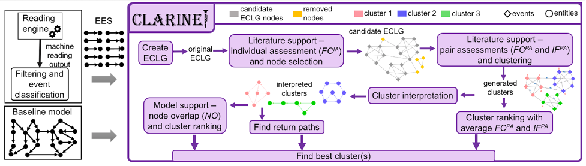

.. CLARINET documentation master file, created by
   sphinx-quickstart on Wed May 19 13:37:15 2021.
   You can adapt this file completely to your liking, but it should at least
   contain the root `toctree` directive.

Welcome to CLARINET's documentation!
====================================
.. image:: https://readthedocs.org/projects/melody-clarinet/badge/?version=latest
    :target: https://melody-clarinet.readthedocs.io/en/latest/?badge=latest
    :alt: Documentation Status
.. image:: https://mybinder.org/badge_logo.svg
    :target: https://mybinder.org/v2/gh/pitt-miskov-zivanov-lab/CLARINET/HEAD?labpath=%2Fexamples%2Fuse_CLARINET.ipynb

CLARINET (CLARIfying NETworks) ia a novel tool for rapid model assembly by automatically extending dynamic network models with the information published in literature. This facilitates information reuse and data reproducibility and replaces hundreds or thousands of manual experiments, thereby reducing the time needed for the advancement of knowledge.

CLARINET objectives
-------------------
1.	Utilizing the knowledge published in literature and suggests model extensions.
2.	Studying events extracted from literature as a collaboration graph, including several metrics that rely on the event occurrence and co-occurrence frequency in literature.
3.	Allowing users to explore different selection criteria when automatically finding best extensions for their models.

CLARINET architecture
---------------------
(Left) CLARINET inputs: Extracted Event Set (EES) and Baseline model. |br|
(Right) Flow diagram of the CLARINET processing steps and outputs.

Applications
------------
The primary application area of CLARINET is dynamic and causal network models.

.. toctree::
   :maxdepth: 2
   :caption: Contents

   CLARINET
   TutorialandInstallation
   Legal

.. # define a hard line break for HTML
.. |br| raw:: html

    
